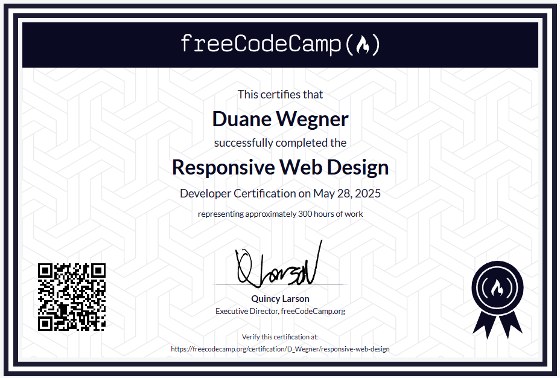

# Responsive Web Design Portfolio

## 🧠 About

This repository showcases a portfolio of responsive web design projects built by following the freeCodeCamp [Responsive Web Design Certification](https://www.freecodecamp.org/learn/2022/responsive-web-design/) curriculums.

The goal of this portfolio is to apply and demonstrate the foundational skills of HTML5 and CSS3, as taught by freeCodeCamp. Each project adheres to responsive design principles, ensuring a seamless experience across various devices.

## 📚 Projects

### The following certified projects were completed independently, with no external guidance beyond the basic structural requirements of the project.

1. **Survey Form** (COMPLETED)

   A form that collects user data, built using semantic HTML and styled with CSS.

2. **Tribute Page** (COMPLETED)

   A simple web page dedicated to Håkon Wium Lie - The Father of CSS.

3. **Product Landing Page** (COMPLETED)

   A mock landing page for a product, featuring media elements and basic layout design.

4. **Technical Documentation Page** (COMPLETED)

   A structured documentation page that mimics real-world tech documentation sites.

5. **Personal Portfolio Page** (COMPLETED)

   A self-designed personal portfolio that links to the above projects and showcases them in a unified layout.

## 💡 Features

- Fully responsive design using CSS Flexbox and Grid
- Semantic HTML5 structure
- Accessible and user-friendly forms and navigation
- Clean, modern UI based on basic HTML and CSS

## 🛠 Technologies Used

- HTML5
- CSS3
- freeCodeCamp's Test Suite (for project validation)

